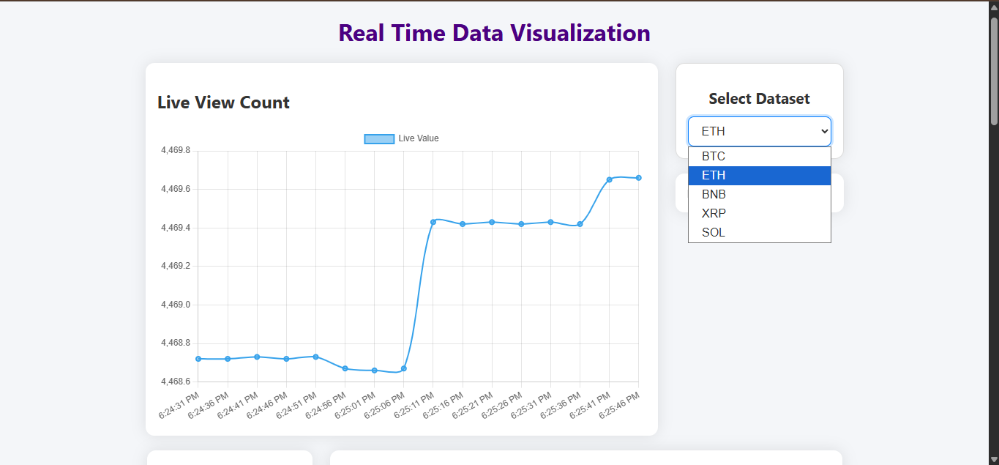
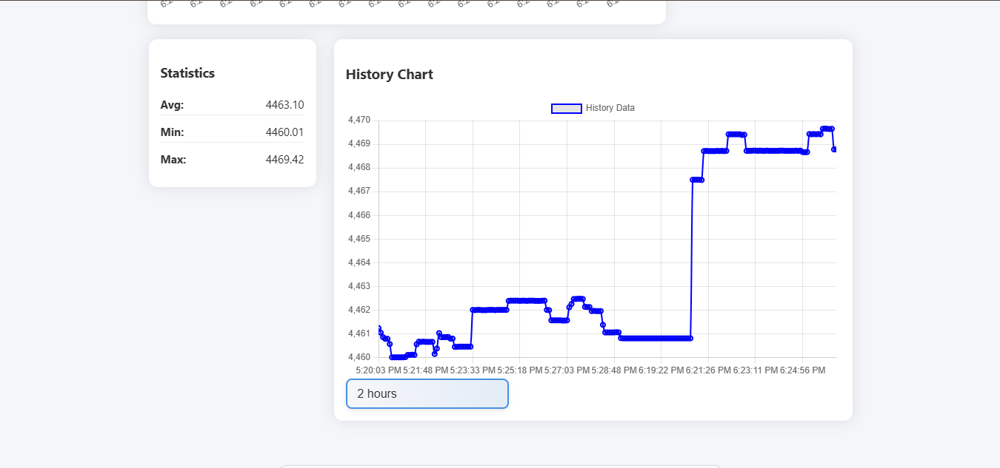
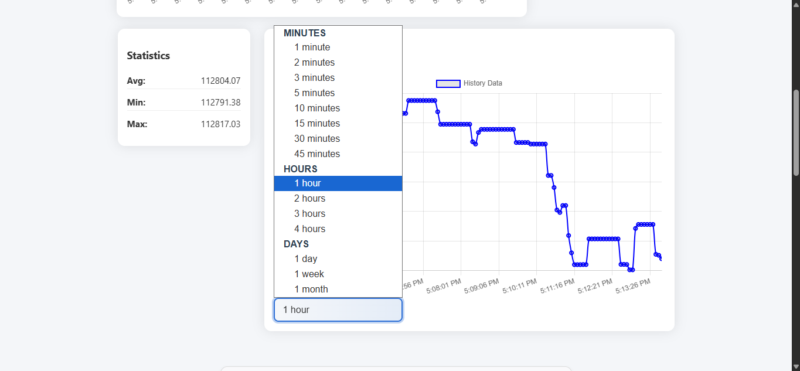
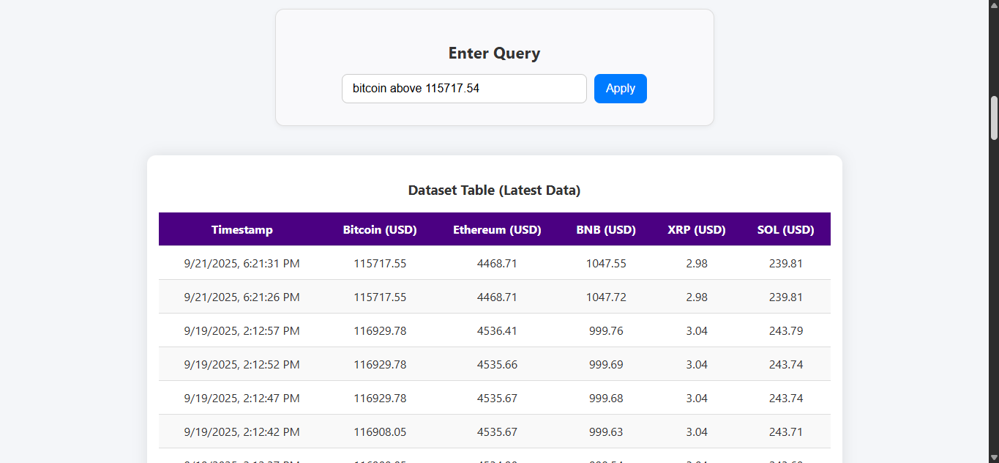

# 🚀 Real-Time Data Analytics and Visualization System

A full-stack web application that provides **real-time data streaming, storage, analytics, and visualization** using modern technologies.

---

## 📌 Features

* 📡 Real-time data updates using **Socket.io**
* 🗄️ Data storage using **MongoDB Atlas**
* 📊 Interactive charts (Live + Historical)
* 🔍 User-based filtering (keyword)
* 📈 Indicators (Moving Average, Volume)
* 📋 Dynamic table with latest filtered data
* ⚡ Fast and responsive UI

---

## 🗂️ Project Structure

```
realtime_data_visualization/
│
├── realtime-dashboard/
│   ├── node_modules/        (ignored)
│   ├── .env                 (environment variables)
│   ├── package.json
│   ├── package-lock.json
│   └── server.js            (backend + DB connection)
│
├── app.js                   (frontend logic)
├── index.js                 (client-side scripts)
├── index.html               (UI structure)
├── style.css                (styling)
```

---

## ⚙️ Tech Stack

* **Frontend:** HTML, CSS, JavaScript
* **Backend:** Node.js, Express
* **Database:** MongoDB Atlas
* **Real-Time Communication:** Socket.io
* **API:** Binance API (Crypto Market Data)

---

## 🔐 Environment Variables

Create a `.env` file inside `realtime-dashboard/`:

```
PORT=3000
MONGO_URI=mongodb+srv://<username>:<password>@cluster0.xxxxx.mongodb.net/?retryWrites=true&w=majority
```

---

## 🚀 Getting Started

### 1️⃣ Clone the repository

```bash
git clone https://github.com/bobbybyte28/realtime-data-visualization.git
cd realtime_data_visualization
```

---

### 2️⃣ Install dependencies

```bash
cd realtime-dashboard
npm install
```

---

### 3️⃣ Configure MongoDB

* Create a cluster in MongoDB Atlas
* Add database user credentials
* Whitelist your IP (`0.0.0.0/0` for testing)
* Paste your connection string in `.env`

---

### 4️⃣ Run the server

```bash
node server.js
```

You should see:

```
Server running at http://localhost:3000
```

---

### 5️⃣ Run the frontend

Open `index.html` using:

* Live Server (recommended)
* Or directly in your browser

---

## 🔄 How It Works

1. Backend fetches real-time crypto data from **Binance API**
2. Data is stored in **MongoDB**
3. Server emits updates via **Socket.io**
4. Frontend dynamically updates:

   * 📈 Live charts
   * 📊 Historical charts
   * 📋 Data table

---

## 📸 Screenshots
  
  

---

